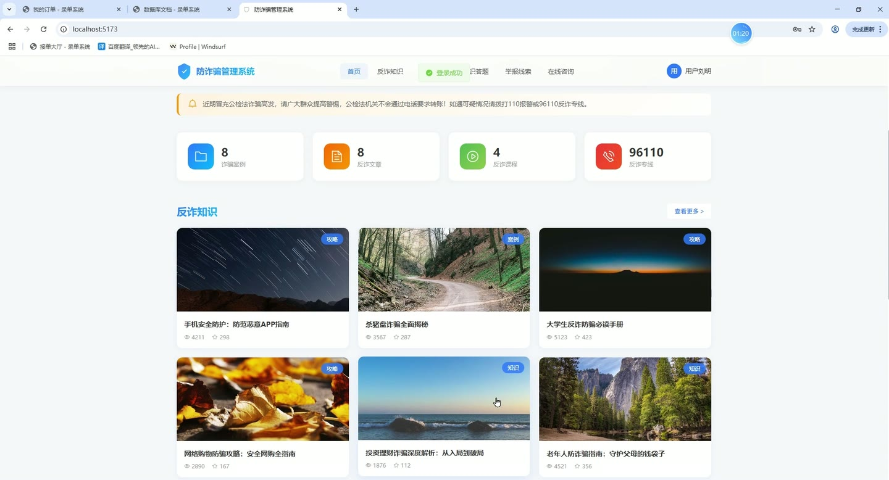
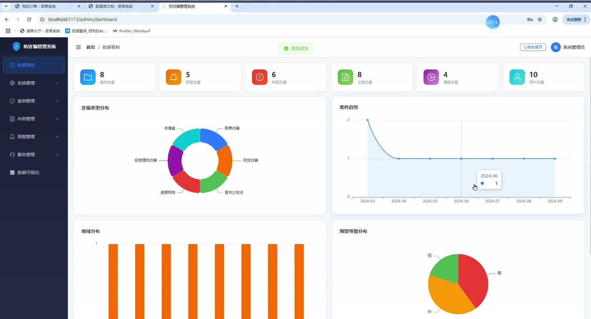
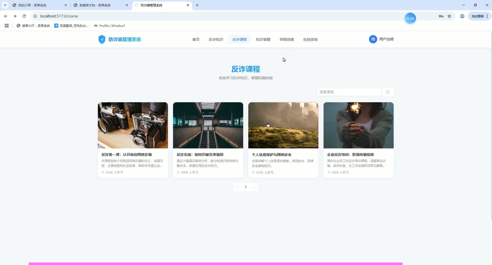
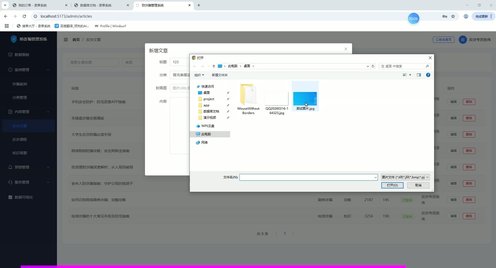
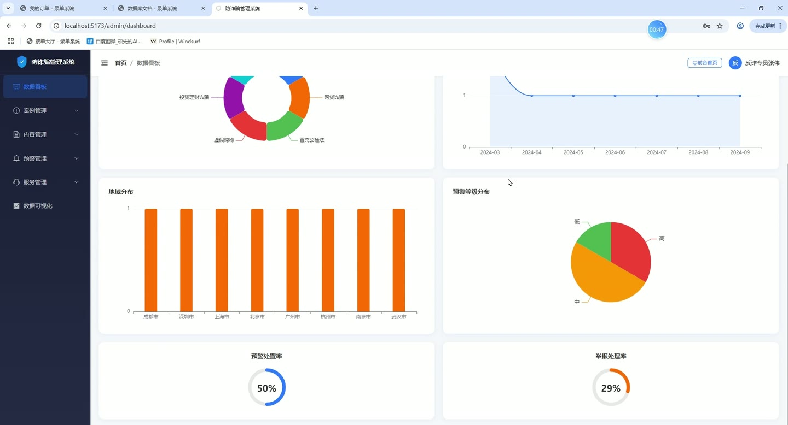

# (附文档)Springboot3+Vue3+MySQL 防诈骗管理系统

**技术栈**：Springboot3、Vue3、MySQL

### 系统简介

本系统是一个基于 Spring Boot 3 + Vue 3 前后端分离架构的防诈骗综合管理平台，包含普通用户端和管理员端两大角色。系统提供防诈骗知识文章与课程学习、诈骗案例库、在线举报、预警信息管理、在线咨询、防诈骗知识问答、数据可视化大屏等功能，旨在通过知识普及、案例警示、线索举报和智能预警等手段，提升公众防诈骗意识与能力。
 
### 核心功能
 
### 普通用户端

 
- 浏览首页轮播图、最新防诈骗文章、热门文章、防诈骗课程及站点公告等聚合数据 
- 查看防诈骗知识文章列表（支持按关键词搜索、按分类筛选、按文章类型筛选） 
- 查看文章详情（自动累加浏览量），对文章进行点赞/取消点赞、收藏/取消收藏操作 
- 查看防诈骗课程列表（支持关键词搜索），查看课程详情（自动累加浏览量） 
- 浏览诈骗案例库列表（支持按关键词、分类、状态、地区筛选），查看案例详情 
- 在线提交举报线索（填写举报类型、目标、描述、证据、联系方式），查看本人历史举报记录及处理状态 
- 查看个人预警通知列表，标记单条或全部预警通知为已读，查看未读预警数量 
- 发起在线咨询（填写标题、内容），查看本人咨询记录及管理员的回复内容 
- 参与防诈骗知识问答（随机抽取指定数量的题目，支持选项A/B/C/D作答） 
- 查看防诈骗分类树（支持多级分类结构） 
- 管理个人资料（修改昵称、头像、手机、邮箱等），修改登录密码（需验证原密码）
 
### 管理员端

 
- 查看控制台统计概览（案例数、预警数、举报数、文章数、课程数、用户数、咨询数）及预警处理率、举报处理率 
- 查看按诈骗分类统计的案例数量分布、按地区统计的案例数量分布、月度案例趋势图、按风险等级统计的预警分布、按分类统计的涉案金额分布 
- 管理用户账户（分页列表，支持按关键词/角色筛选、新增用户、编辑用户、删除用户、启用/禁用账户、重置密码为123456） 
- 管理系统角色（分页列表，支持新增、编辑、删除角色，配置角色名称、角色标识、描述） 
- 管理诈骗案例（分页列表，支持按关键词/分类/状态/地区筛选、新增案例、编辑案例、删除案例、修改案例状态） 
- 管理诈骗分类（树形列表/分页列表，支持新增、编辑、删除一级/二级分类，配置分类名称、排序、状态） 
- 管理知识文章（分页列表，支持按关键词/分类/类型/状态筛选、新增文章、编辑文章、删除文章，支持Markdown内容编辑） 
- 管理防诈骗课程（分页列表，支持按关键词/状态筛选、新增课程、编辑课程、删除课程，支持视频链接、封面图、排序） 
- 管理预警规则（分页列表，支持新增、编辑、删除规则，配置规则名称、类型、内容、风险等级、启用状态） 
- 查看预警记录列表（支持按状态筛选），处理预警记录（分配处理人、填写处理结果、填写引导建议） 
- 管理举报线索列表（支持按状态/举报类型筛选），处理举报（填写处理结果） 
- 管理在线咨询列表（支持按状态筛选），回复用户咨询（填写回复内容） 
- 管理轮播图（分页列表，支持新增、编辑、删除轮播，配置标题、图片链接、跳转链接、排序、启用状态） 
- 管理字典数据（分页列表，支持按字典类型筛选、新增字典项、编辑、删除，配置字典类型、键、值、排序、状态） 
- 管理系统配置（分页列表，支持新增、编辑、删除配置项，配置键、值、描述，支持站点名称、站点描述、站点公告等动态配置） 
- 查看操作日志（分页列表，支持按关键词搜索用户名或操作内容，支持单条删除、一键清空所有日志） 
- 管理防诈骗知识问答题目（分页列表，支持新增、编辑、删除题目，配置问题、选项A/B/C/D、正确答案、解析、关联分类） 
- 文件上传（支持上传图片等文件，返回可访问的URL路径）
 
### 技术栈

  后端框架 Spring Boot 3   ORM MyBatis-Plus   权限认证 JWT（jjwt）、BCrypt 密码加密   前端框架 Vue 3   状态管理 Vuex / Pinia（按实际项目）   构建工具 Vite   数据库 MySQL   其他 Hutool 工具包、Lombok、RESTful API 
 
### 交付内容

 
- 后端完整源码 
- 前端完整源码 
- 数据库初始化脚本 
- 万字文档

## 界面展示

---

## 获取完整源码 + 万字文档

本仓库为项目介绍页。**完整前后端源码、数据库初始化脚本、万字项目文档**，请加微信 `kangkangcode`，或访问 [codekk.top](http://codekk.top) 获取。

可作课程设计 / 毕业设计参考，支持远程部署调试。